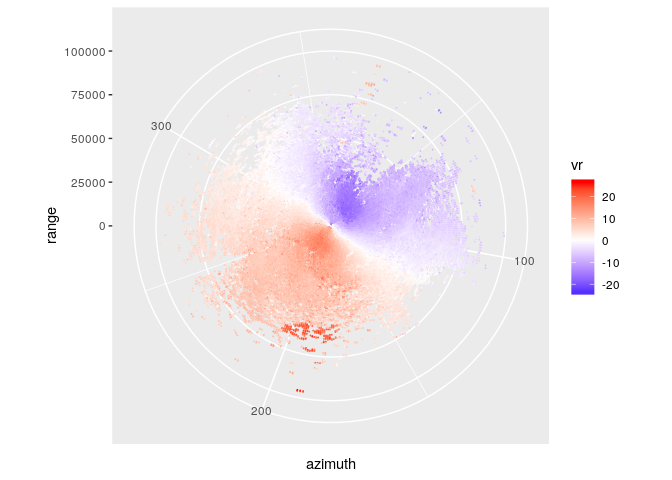
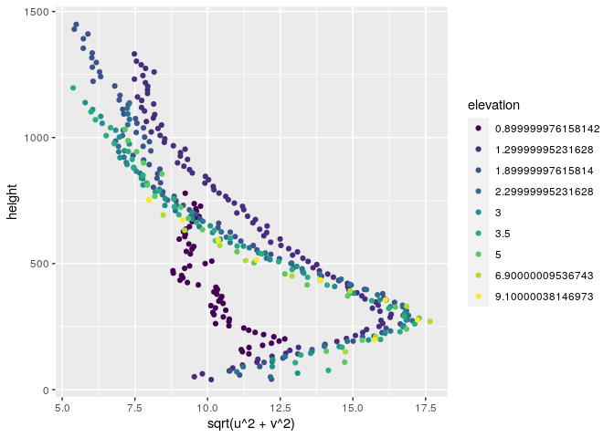
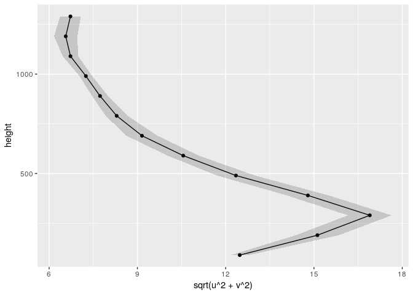

<!-- README.md is generated from README.Rmd. Please edit that file -->

# rvad

<!-- badges: start -->

<!-- badges: end -->

The goal of rvad is to approximate the horizontal components of the wind
from radial wind measured by Doppler radar using the Velocity Azimuth
Display method from [Browning and Wexler
(1968)](https://journals.ametsoc.org/doi/abs/10.1175/1520-0450%281968%29007%3C0105%3ATDOKPO%3E2.0.CO%3B2).

## Installation

You can install the development version from
[GitHub](https://github.com/)
with:

<!-- the released version of rvad from [CRAN](https://CRAN.R-project.org) with:

``` r
install.packages("rvad")
```

And -->

``` r
# install.packages("devtools")
devtools::install_github("paocorrales/rvad")
```

## Example

rvad estimates the horizontal components of wind from radial velocity
measured with Doppler radar. It takes data on a tidy format –one value
of radial velocity for each azimuth, elevation angle and distance to the
radar (range):

``` r
library(rvad)
str(radial_wind)  # sample dataset
#> Classes 'data.table' and 'data.frame':   2076960 obs. of  4 variables:
#>  $ range    : int  250 750 1250 1750 2250 2750 3250 3750 4250 4750 ...
#>  $ vr       : num  NA NA -4.189 0.419 -4.556 ...
#>  $ azimuth  : num  214 214 214 214 214 ...
#>  $ elevation: num  0.5 0.5 0.5 0.5 0.5 0.5 0.5 0.5 0.5 0.5 ...
#>  - attr(*, ".internal.selfref")=<externalptr>
```

This is how the data looks like for one particular elevation angle.

``` r
library(ggplot2)
#> Registered S3 methods overwritten by 'ggplot2':
#>   method         from 
#>   [.quosures     rlang
#>   c.quosures     rlang
#>   print.quosures rlang
one_elevation <- subset(radial_wind, elevation == unique(elevation)[3] &
                          !is.na(vr))
ggplot(one_elevation, aes(azimuth, range)) +
  geom_point(aes(color = vr, size = range^2)) +
  scale_radius(range = c(0, 0.05), guide = "none") +
  scale_color_gradient2(low = "blue", high = "red") +
  scale_y_continuous(limits = c(0, 100000)) +
  coord_polar()
#> Warning: Removed 259 rows containing missing values (geom_point).
```

<!-- -->

Red means that the wind is moving away from the radar and blue is wind
moving towards the radar. So this plot shows that, overall, the wind is
comming from the northeast.

`vad_fit()` does some quality control and then fits a sinusoidal model
to the data and returns zonal and meridional wind for each elevation
angle, and range. It also approximates the propagation of the radar beam
to get the height of each observation.

``` r
VAD <- with(radial_wind, vad_fit(vr, azimuth, range, elevation))
str(VAD)
#> Classes 'rvad_vad' and 'data.frame': 5760 obs. of  7 variables:
#>  $ height   : num  2.19 6.58 11 15.45 19.93 ...
#>  $ u        : num  NA NA NA NA NA NA NA NA NA NA ...
#>  $ v        : num  NA NA NA NA NA NA NA NA NA NA ...
#>  $ range    : int  250 750 1250 1750 2250 2750 3250 3750 4250 4750 ...
#>  $ elevation: num  0.5 0.5 0.5 0.5 0.5 0.5 0.5 0.5 0.5 0.5 ...
#>  $ r2       : num  NA NA NA NA NA NA NA NA NA NA ...
#>  $ rmse     : num  NA NA NA NA NA NA NA NA NA NA ...
#>  - attr(*, "rvad_raw")= logi TRUE
```

``` r
plot(VAD)
```

<!-- -->

The optimal quality control parameters (minimum \(R^2\), maximum missing
values, etc…) can be case-dependant so it’s advisable to test different
values.

`vad_regrid()` aggregates the result into a single wind profile defined
in a regular grid using local regression.

``` r
wind_profile <- vad_regrid(VAD, layer_width = 100)

plot(wind_profile)
```

<!-- -->
